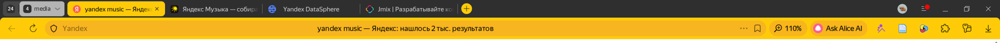

# Yandex Browser Yellow&Black

A Firefox theme that reproduces the color scheme of Yandex Browser's yellow theme: a dark (near-black) tab bar and a golden-yellow toolbar/address bar. Works with both the regular horizontal tab strip and the **vertical TabBar** — `sidebar_*` colors are set separately so the active tab stays yellow and the strip background stays dark there too.

<p align="center">
  
</p>

*The screenshot above is the original Yandex Browser used as a color reference (not a screenshot of the theme running in Firefox).*

## Color palette

| Element | Color |
|---|---|
| Tab bar / `frame` | `#2f2f2f` |
| Active tab / `tab_selected` | `#ffcb09` |
| Inactive tab text | `#d9d9d9` |
| Toolbar and address bar / `toolbar` | `#f7b520` |
| Toolbar text and icons | `#262524` |
| Vertical TabBar (background / active tab) | `#2f2f2f` / `#ffcb09` |

## Installation

### Option A — via the Add-ons Manager (Mozilla AMO)

The theme has been submitted to addons.mozilla.org and is currently **pending review**:

- Developer page (visible only from my account while the review is in progress): https://addons.mozilla.org/en-US/developers/addon/yandex-browser-yellow-black
- Public listing page (will become available to everyone once approved): https://addons.mozilla.org/en-US/firefox/addon/yandex-browser-yellow-black/

Once AMO approves the theme, the second link will let anyone install it in one click via "Add to Firefox".

### Option B — temporary manual install (works right now, no need to wait for review)

1. Open `about:debugging#/runtime/this-firefox` in the address bar.
2. Click **"Load Temporary Add-on…"**.
3. Select the [`manifest.json`](manifest.json) file from this repository.

The theme applies immediately, but is removed on browser restart — repeat these steps after every launch.

### Option C — permanent install from a `.xpi` (no need to wait for AMO)

Build the archive (see "Build" below) and install it as an unsigned add-on:

- **Firefox Developer Edition / Nightly / ESR**: set `xpinstall.signatures.required = false` in `about:config`, then drag the `.xpi` into the browser window.
- **Regular release Firefox**: a permanent install of an unsigned `.xpi` isn't possible — wait for AMO approval (Option A) or use Option B.

## Build

```bash
zip -r -X yandex-browser-yellow.xpi manifest.json icons
```

## Repository layout

```
manifest.json   — theme manifest (WebExtension theme, manifest_version 3)
icons/          — add-on icon shown in about:addons (48px, 96px)
screenshots/    — reference screenshot of Yandex Browser
```
